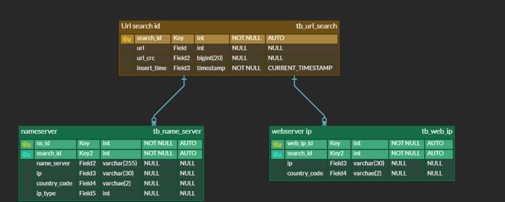

# [](http://www.babygopher.org) NameServer_Finder

Walk the DNS tree to find which name servers a particular zone uses. Mimics "dig +trace", reads the URL from a CSV file and stores the IPs of the entered URL, the IP of the URL's nameserver, and the country code using GEOIP.<br><br>

# Building

After a git clone;

make file : Config/dbConfig.env

```
$ touch Config/dbConfig.env
$ vi Config/dbConfig.env
// Write your database config
```

build & execute

```
$ go build
$ ./NameServer_Finder {csvfile name}
```

# Examples

Here's what it looks like for `test.csv`

```
[test.csv]
url,url_crc,ip
https://intercrypto.com,143273094,192.99.100.45
https://download.mywebface.com,855349189,35.201.91.40
https://m14.xozejjt.com,2315816021,157.56.160.177
```

You should make file `outputDBConfig.env` under `Config` directory

```
ex)
# dbconfig.env
DB_USER={your user}
DB_PASSWORD={your pw}
DB_NETWORK=tcp
DB_ADDRESS={your db ip}:{db port}
DB_NAME={yout db name}

```

output

```
----------------------------------------------------------------------------
🔎Finding nameservers for zone 'com.' using parent nameserver 'b.root-servers.net.'

🔎Finding nameservers for zone 'intercrypto.com.' using parent nameserver 'c.gtld-servers.net.'

📜nameserver List:
[ns3.intercrypto.com. ns4.intercrypto.com.]

📜IP Addresses for nameservers:
192.99.100.45 ca
192.99.100.45 ca

📜IP Addresses for intercrypto.com. :
192.99.100.45 ca
----------------------------------------------------------------------------
🔎Finding nameservers for zone 'com.' using parent nameserver 'k.root-servers.net.'

🔎Finding nameservers for zone 'mywebface.com.' using parent nameserver 'j.gtld-servers.net.'

📜nameserver List:
[dns1.p03.nsone.net. dns2.p03.nsone.net. dns3.p03.nsone.net. dns4.p03.nsone.net.]

📜IP Addresses for nameservers:
198.51.44.3 us
2620:4d:4000:6259:7:3:0:1 us
198.51.45.3 us
2a00:edc0:6259:7:3::2 us
198.51.44.67 us
2620:4d:4000:6259:7:3:0:3 us
198.51.45.67 us
2a00:edc0:6259:7:3::4 us

📜IP Addresses for download.mywebface.com. :
35.201.91.40 us
----------------------------------------------------------------------------
🔎Finding nameservers for zone 'com.' using parent nameserver 'a.root-servers.net.'

🔎Finding nameservers for zone 'xozejjt.com.' using parent nameserver 'd.gtld-servers.net.'

📜nameserver List:
[ns102a.microsoftinternetsafety.net. ns102b.microsoftinternetsafety.net.]

📜IP Addresses for nameservers:
13.107.222.41 us
13.107.206.41 us

📜IP Addresses for m14.xozejjt.com. :
157.56.160.177 us

```

The word to the right of IP stands for country code.<br>
The results are available on the screen and also stored in the database. <br>
Logging functionality is being added.

# Database ERD


<br>

# Why?

Why not just query directly for `NS` records, you ask? Not everyone keeps those up-to-date and they often return outdated or wrong information, as nameservers change without modifying the `NS` records to reflect that.

In other words: the only _absolutely_ way to find our which nameservers a particular zone uses, you have to walk the DNS tree.

# Credits

This code is initially based on the [check-soa](https://github.com/miekg/exdns/tree/master/check-soa) script by [miekg](https://github.com/miekg)
<br><br>
This repository is based on the following repository.<br>
➡️https://github.com/DNSSpy/zone-nameservers
